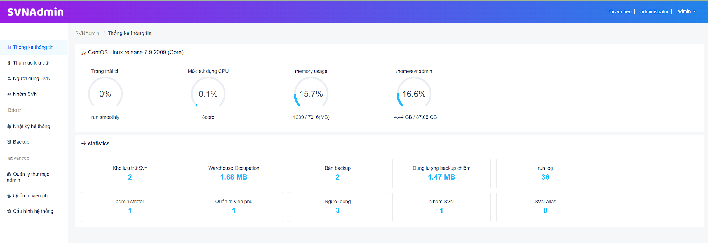
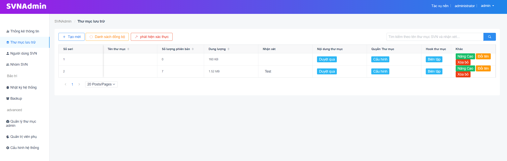

# SVNAdmin2 - Hệ thống quản lý SVN trên nền web

### 1. Giới thiệu

- SVNAdmin2 là **chương trình web** quản lý SVN phía máy chủ thông qua giao diện đồ họa.

- Trong trường hợp thông thường, để cấu hình quyền nhân sự của kho SVN, bạn cần đăng nhập vào máy chủ để sửa đổi thủ công các tệp authz và passwd.Khi cấu trúc kho và quyền nhân sự được mở rộng, việc quản lý thủ công trở nên rất dễ xảy ra lỗi . Hệ thống này có thể xác định nhân sự và quyền và cung cấp các chức năng quản lý và mở rộng.

- SVNAdmin2 hỗ trợ **kiểm tra giao thức SVN, kiểm tra giao thức HTTP**, hỗ trợ chuyển đổi giữa hai giao thức và hỗ trợ triển khai docker hoặc triển khai mã nguồn.

- SVNAdmin2 hỗ trợ **truy cập LDAP**, để đạt được mục đích sử dụng cơ cấu nhân sự và quy tắc phân nhóm ban đầu.

- [Link code GitHub](https://github.com/bibo318/SVNAdmin_web) 
- demo1

- demo2

### 2. Khả năng tương thích

**docker > CentOS7 > CentOS8 > Rocky > Ubuntu**>.............

Nếu được yêu cầu trong Windows, bạn có thể sử dụng phiên bản docker

Phiên bản PHP: [php5.5, php8.2] (phát triển dựa trên php7.4 nên khuyến khích sử dụng php7.4)

Cơ sở dữ liệu: SQLite, MySQL

Lật đổ: 1.8+

### 3. Cài đặt tham khảo bản gốc   
- [Link GitHub](https://github.com/witersen/SvnAdminV2.0)   
 

